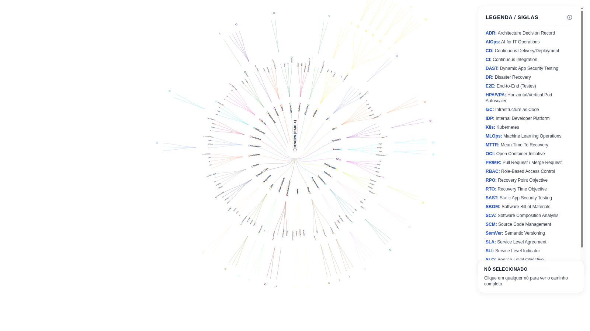

# Bíblia DevOps — Mapa Mental

Mapa mental interativo em D3.js.

## Demo
https://josegoncalves1.github.io/mind_map_devops/

## About
Um mapa mental completo de DevOps com navegação por zoom e expansão de níveis.

## Topics (tags sugeridas)
devops, mindmap, d3js, visualization, ci-cd, kubernetes, iac, cloud, git, sre

## Como abrir localmente
1. Abra o arquivo `mapa.html` no navegador.
2. Use scroll para zoom e arraste para navegar.

## Publicar no GitHub Pages (recomendado)
Para ver o mapa renderizado no GitHub, use o GitHub Pages.

1. Copie `mapa.html` para `index.html` (já deixei `index.html` criado se existir).
2. No GitHub: Settings → Pages → Source: `main` / `(root)`.
3. Acesse o link público do Pages (ele renderiza o HTML).

## Arquivos
- `mapa.html`: versão principal do mapa
- `mapa`: cópia do HTML (mesmo conteúdo)
